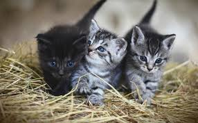

# Titulo 1
## Titulo 2
### Titulo 3
#### Titulo 4
##### Titulo 5
###### Titulo 6

**Estas son letras negritas**

_Ejemplo de texto en cursiva_

**_Ejemplo de combinacion entre cursiva y negritas_**

[youtube](https://youtube.com)

[Ejemplo de encabezado ancla](#titulo-6)



---

Hola mundo

---

1. Hola
2. mundo

* Hola
* mundo

- Hola
    - hello
    - hi
- mundo
    - world
        - people


> Hello world

> Hola mundo

| Nombre | Edad | Correo |
| --- | --- | --- |
| Sergio | 26 | sergio@gmail.com |

Para declarar una variable utilizamos la palabra reservada `let`

``` js
function sumar (a,b) {
    return a + b
}
```

<form>
    <label for="searchInput">Buscar:</label>
    <input type="search" id="searchInput">
</form>

<!-- Este es un comentario -->

[Iconos](https://emojipedia.org/star)
[Mas iconos](https://github.com/ikatyang/emoji-cheat-sheet?tab=readme-ov-file#people--body)

⭐

😺

Markdown: \_hola\_ Resultado: _hola_